# Anchors — User Guide

**Anchors** is an alternative to systems like the popular **Stamps** library, creating a named anchor-and-link system for
reusable inputs. Drop a named **anchor** on any stream, then reference it from
lightweight **Link** nodes anywhere in the script with a colour-coded fuzzy find menu (like the Tab menu - accessed through "A"). Copy and
paste become reconnection-aware, so pasted Links retain their inputs instead of
arriving with dangling pipes.

Anchors has a couple main advantages over competing solutions. Firstly is performance. Links are native hidden inputs - no callbacks, no expressions, and therefore no performance impact on your script. Second is the built-in navigation workflow - you can jump to any Anchor (or labelled backdrop) with a convenient fuzzy-find menu (Alt-A), and jump back to where you were (Alt-Z), which means as you build your script, it remains easy to navigate.

# Anchors in practice

## The problem: reusing a node

Every comp reuses the same source in different places, sometimes in many many places. A plate feeds the base of the
comp and is reused many times in the foreground layer; a CG render feeds the beauty *and* is needed in different places for Cryptomattes, P_Mattes, IDs, etc., and in the foreground section to limit the range of edge work; a camera drives multiple different projections and renders.

Nuke gives you two obvious ways to reuse a node, and both go wrong as the script grows.

**Duplicate the node.** Copy the Read and paste it wherever you need it again. Now
the same logical source lives in the script multiple times `(Figure \ref{fig:problem-reads})`{=latex}, and every one of those copies
is a separate node to keep in sync. With the best will in the world, in a complex script, mistakes will be made when it comes time to update the node. It's all too easy to update 11 of the 12 places the CG layer is used and introduce a subtle bug into your comp.

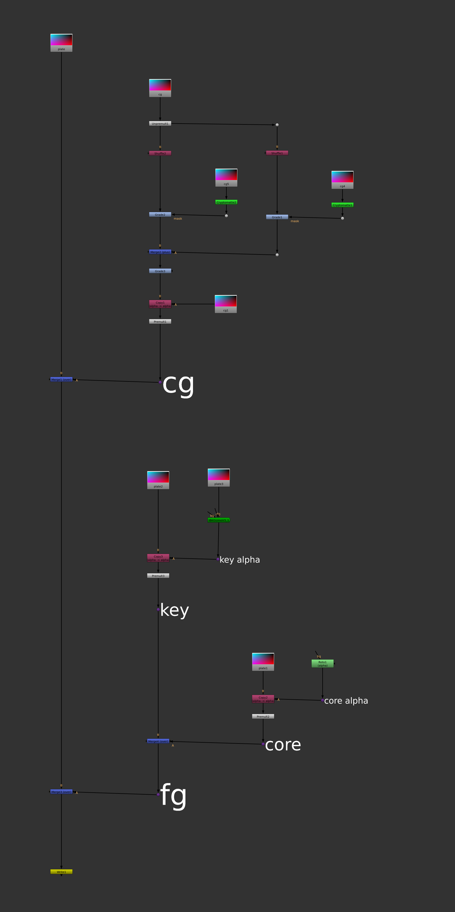{#fig:problem-reads}

**Run a long pipe.** Keep a single Read and drag its output across the whole script
to each place that needs it `(Figure \ref{fig:problem-pipes})`{=latex}. Now there is only one node to maintain, but the
graph is a cat's cradle of long pipes: these are extremely hard to read, very easy to disconnect by
accident, and awkward to lay out — every new node means routing around the pipes
that already cross the script, which makes working in the script frustrating and error prone, and makes one shy away from the kinds of restructuring that scripts often need.

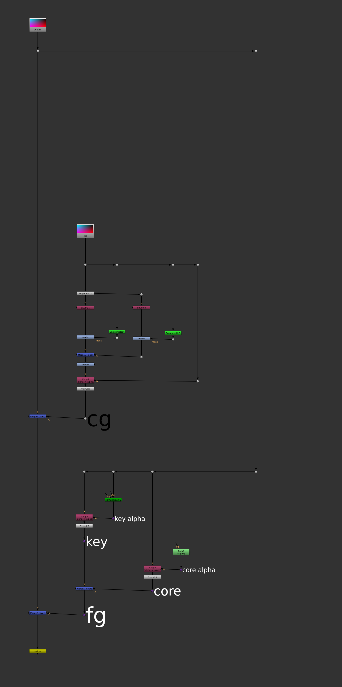{#fig:problem-pipes}

A third option — a bare hidden input — keeps the graph clean until you copy/paste a block
that contains it, at which point the hidden connection silently breaks and leaves a
node wired to nothing, with no record of what it was meant to connect to.

## The solution: anchors and links

An **anchor** is a small named node you drop onto a stream. A **link** is a
lightweight node that references an anchor *by name* — its input is hidden, so the
connection travels by name instead of a drawn pipe. Wherever you would have
duplicated a Read or run a long pipe, you drop one anchor on the source and place
links instead `(Figure \ref{fig:solution})`{=latex}.

{#fig:solution}

You get the tidy graph of a hidden input *and* the safety of a named reference: the
plate and the CG each exist exactly once, the links carry their names so the graph
reads at a glance, and — as we will see — a block of links repairs its own
connections when you copy and paste it, even into another script. The script is easy to understand, easy to work on, and easy to expand. Blissful productivity.

## A real comp

Here is the same idea demonstrated in a simple comp script`(Figure \ref{fig:example-script})`{=latex}: a CG
render with breakout and mattes, a projected matte painting, a key, and a
rotoed core matte. The sources are collected into an **input block** at the
top of the script, and the comp below is a single clean spine of links — no source
is ever piped across the graph or duplicated.


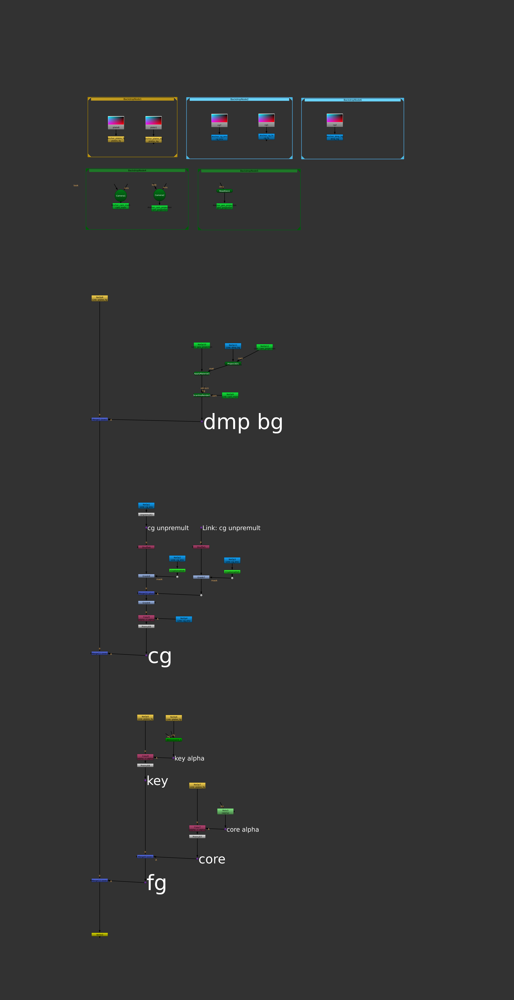{#fig:example-script}

## Organising sources: the "input block"

This is the idiomatic usage of Anchors, and is the absolute best way to build a script. All sources live in one place at the top of the script with an Anchor attached to allow Links to them throughout the script `(Figure \ref{fig:library})`{=latex}.

Colour groups them by
type — plates gold, CG and matte-paintings blue, cameras and geo green — so the
whole cast of the comp is legible in one spot, and every link elsewhere in the
script inherits its anchor's colour.

Of course, the colours are up to you, and if - as in this example - you place each type in a coloured backdrop, the Anchors will by default pick up the colour of the backdrop, making it easy to be consistent.

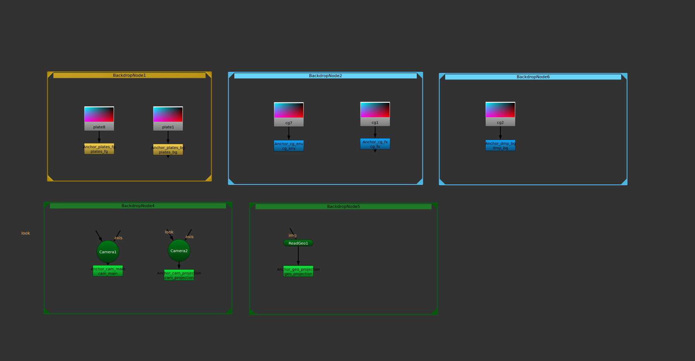{#fig:library}

## Reusing and expanding

With the sources anchored, extending the comp is easy. Working from the example above, we can add a clean-plate projection setup to the IBKGizmo.

Hit "A" to bring up the fuzzy-find menu `(Figure \ref{fig:fuzzy-find})`{=latex}and drop links to the camera and the plate and wire them up — no new Reads,
no pipes dragged across the script `(Figure \ref{fig:expansion})`{=latex}. And because your module inputs have clean hidden inputs, your modules remain visually and logically distinct from the rest of the script and easy to enlarge with more nodes.

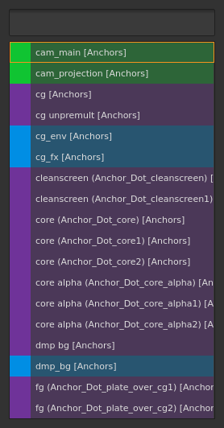{#fig:fuzzy-find}

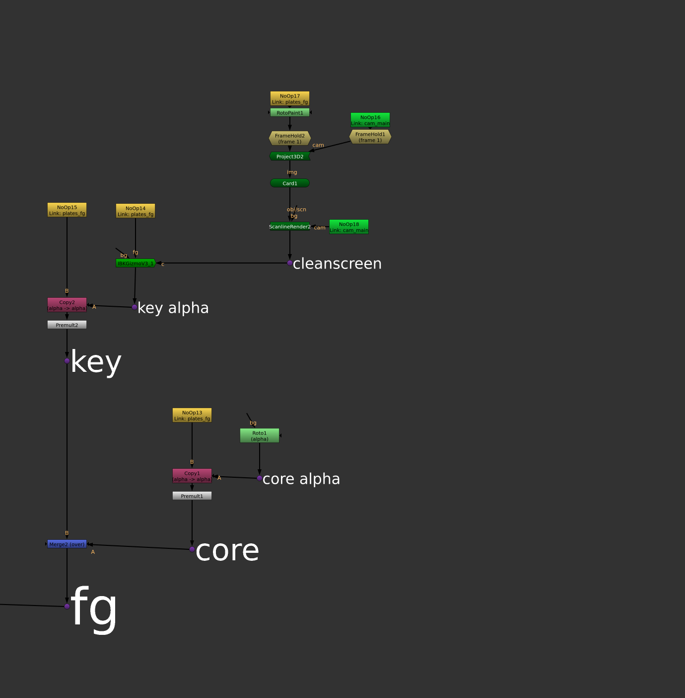{#fig:expansion}

The same anchors serve a second version of the comp just as easily — a variant key
and a keymix built entirely from links to the sources you already anchored `(Figure \ref{fig:reuse})`{=latex}.

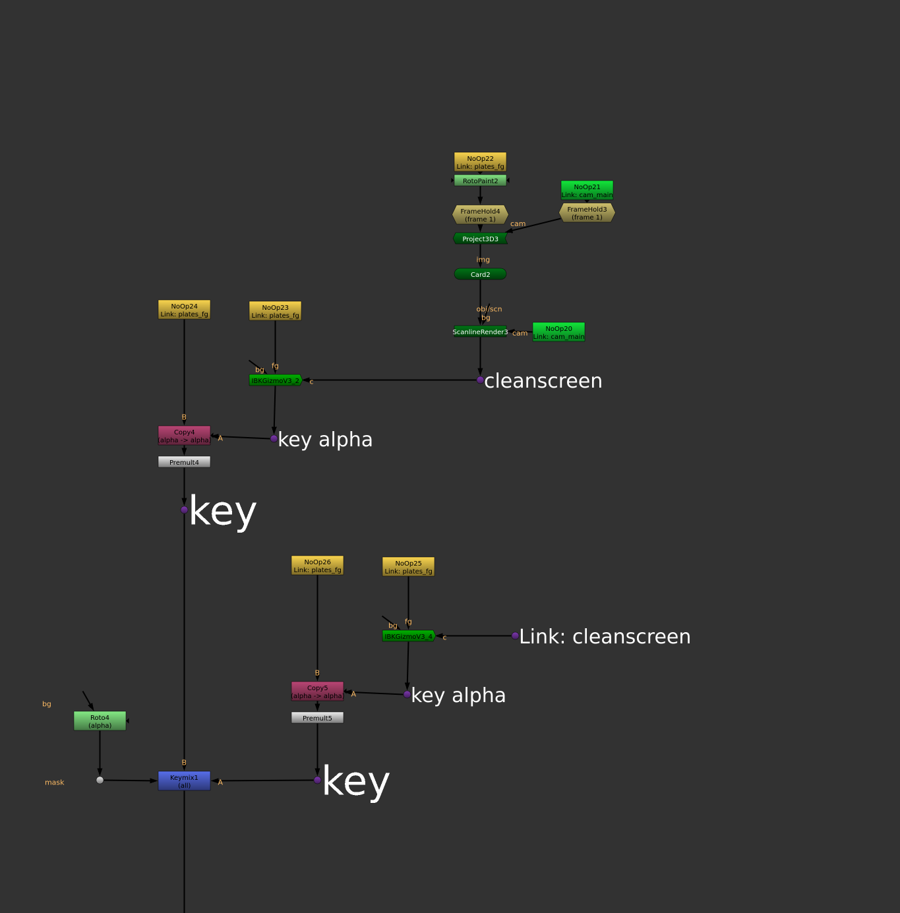{#fig:reuse}

## Finding your way

One feature we haven't touched on is **Anchor Dots**. Dots at the output of a module are the best way of labelling a module (sticky notes can get lost as the script is expanded/reorganized because they're not wired in, backdrops create busy work expanding the backdrop as you add nodes).

Anchors takes advantage of and enables that workflow in two ways. One, Shift-B/N/M respectively label a Dot with a small/medium/large label (perfect for labelling modules/sub-modules/sub-sub-modules and making clear that hierarchy). Two, Dots labelled in this way are **Anchor Dots** - they get a special colour and operate the same as regular Anchors in your script.

As a script fills with links, the anchors become navigation landmarks. Press
**`Alt`+`A`** `(Figure \ref{fig:nav-picker-first})`{=latex} for a fuzzy-search picker of every anchor and labelled backdrop and
the graph zooms straight to the one you choose `(Figure \ref{fig:jump-target})`{=latex}. With a link selected,
**`Alt`+`J`** jumps to its source anchor `(Figure \ref{fig:jump-source})`{=latex}.

Either way the graph frames the anchor together with the tree feeding it, so you
land on the whole module. When you would rather an anchor were *only* a landmark —
a bookmark part-way down a long spine, say — tick **Jump to anchor only** in its
properties panel and jumps to it centre on the anchor itself and leave its tree
alone. The box is unticked on every existing anchor, so nothing changes until you
ask for it.

After jumping with **`Alt`+`A`** or **`Alt`+`J`**, **`Alt`+`Z`** jumps you back
to where you were.

This enables a wonderfully quick way of getting around your script. As you document your work with labelled dots, you're also creating a map of the script for quick navigation. **`Alt`+`S`** shows you that map directly — see [The spatial view](#the-spatial-view).

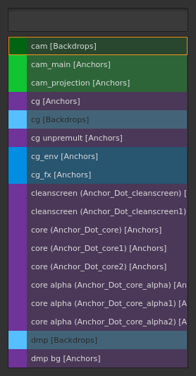{#fig:nav-picker-first}

{#fig:jump-target}

{#fig:jump-source}


## Anchors: the three tiers

### Anchors

The standard anchor. Select a node and press **`A`** (or **Edit > Anchors >
Create Anchor**). A `NoOp` anchor is created beneath the node, wired to it, and
named from the source `(Figure \ref{fig:create-anchor})`{=latex}.

A matching **link** is created directly below the new anchor, so you get both
halves of the pair from one gesture — drag the link wherever you need it. If you
would rather create links yourself, switch off **Create a link below each new
anchor** in Preferences.

Each NoOp anchor's properties panel carries three buttons and a checkbox:

- **Reconnect Child Links** — rewire every link that points at this anchor.
- **Rename** — rename the anchor and update all of its links automatically.
- **Set Color** — open the colour palette and recolour the anchor and its links.
- **Jump to anchor only** — when ticked, jumping to this anchor frames the anchor
  by itself instead of the tree above it.

By convention, "true" Anchors are used for the inputs of the script, not for sections within the script.

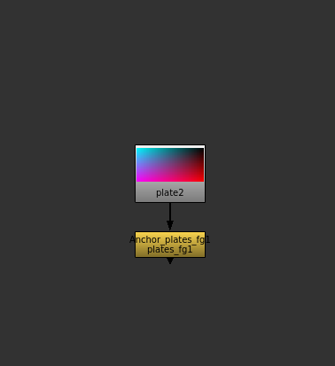{#fig:create-anchor}

### Dot anchors

For lightweight, in-graph signposting, promote a plain **Dot** to an anchor by
selecting it and pressing a label key:

| Key | Size | Font |
|-----|------|------|
| `Shift`+`B` | Small | 33 pt |
| `Shift`+`N` | Medium | 66 pt |
| `Shift`+`M` | Large | 111 pt |

Any Dot whose label is **33 pt or larger** is treated as an anchor and appears in
the navigation picker. Dot anchors are always the default purple and propagate
their label to any links pointing at them `(Figure \ref{fig:dot-anchors})`{=latex}.
They carry the same **Jump to anchor only** checkbox as NoOp anchors.

By convention, **Dot Anchors** are used *within the script*, never for input sources.

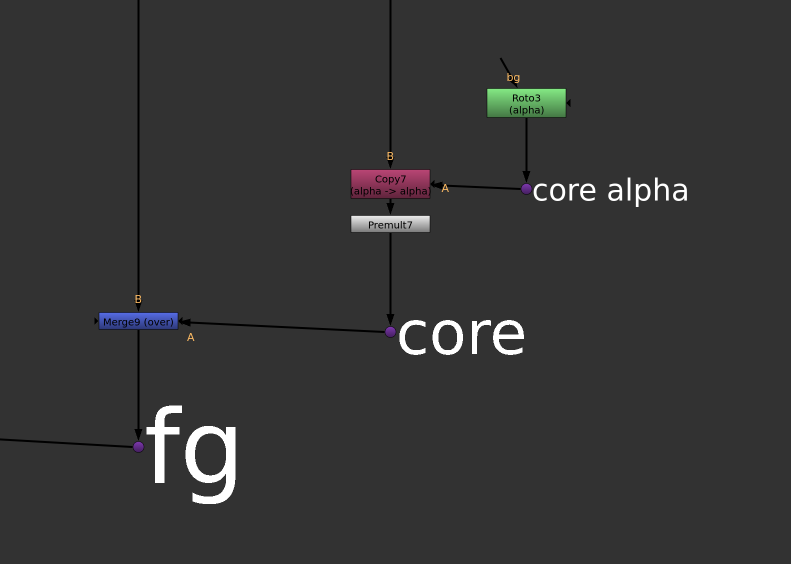{#fig:dot-anchors}

### Local Dots

A **Local Dot** is a hidden-input Dot that points at a *plain* node (not an
anchor). It reconnects only within the same script — never across scripts — and is
stamped burnt-orange with a `Local: <source>` label. Local Dots are produced when
you hide the input of a wired Dot (**`Alt`+`H`**, or **Edit > Node > Input
On/Off**).

These are handy for re-using sections of a module within the module. If you're re-using something across modules, it's better to create a **Dot Anchor** as a named source.


## Creating links

Unless you have switched the preference off, every new anchor already arrives
with a link beneath it (see **Anchors** above). To create further links to an
existing anchor:

With **nothing selected**, press **`A`** to open the Anchor selection menu. It lists every
anchor `(Figure \ref{fig:link-picker})`{=latex} in the script with its colour; choose one and a link is created at the
cursor, wired to that anchor.

{#fig:link-picker}

The link type is chosen automatically from the source: a **Dot** source produces a
**Dot** link; anything else produces a **NoOp** link. Each link carries a
**Reconnect** button and inherits the anchor's colour, updating automatically when
the anchor's colour changes.

You can also create links for several selected anchors at once via **Edit >
Anchors > Create Link**.


## Copy, cut, and paste with hidden-input reconnection

The plugin overrides the standard clipboard shortcuts (scoped to the Node Graph):

- **`Ctrl`+`C`** — copy. Hidden reference knobs are stamped on the selected nodes
  before copying, then the originals are restored (the copy is non-destructive).
- **`Ctrl`+`X`** — cut. As copy, but moves anchors cleanly.
- **`Ctrl`+`V`** — paste. Each Link looks up its anchor `(Figures \ref{fig:paste-before} and \ref{fig:paste-after})`{=latex} and rewires:
  - **Same script, same scope:** links reconnect to the original anchors.
  - **Across scripts:** links reconnect by the anchor's display name if a matching
    anchor exists in the destination.
  - **Local Dots:** reconnect by identity, same-script only.
  - **Pasting only anchors:** If you copy *only* Anchors, each pasted anchor is replaced by a Link pointing
    back to the original, so you do not get duplicate anchors.

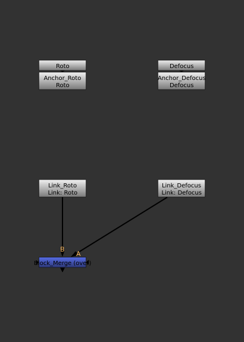{#fig:paste-before}

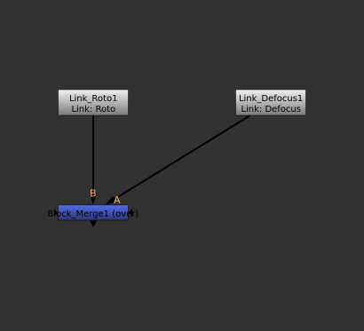{#fig:paste-after}

**Paste Multiple** (**Edit > Paste Multiple**) pastes repeatedly, re-piping each
copy. For a plain paste with no reconnection magic, use **Paste (old)**
(**`Ctrl`+`Shift`+`D`**); **Copy (old)** and **Cut (old)** are also available under
**Edit > Anchors**.


## Navigation

| Shortcut | Action |
|----------|--------|
| `Alt`+`A` | **Anchor Find** — fuzzy-search picker `(Figure \ref{fig:nav-picker})`{=latex} of all anchors and labelled backdrops; zooms to the chosen entry. |
| `Alt`+`J` | **Anchor Jump** — with a Link selected, jump to its source anchor. |
| `Alt`+`L` | **Cycle Links** — with an anchor selected, step through each of its links. Keep pressing `L` to advance; any other key stops. |
| `Alt`+`Z` | **Anchor Back** — return to the viewport position from before the last jump. |
| `Alt`+`S` | **Spatial View** — a map of the script's anchors and backdrops; see below. |

Both **Anchor Find** and **Anchor Jump** frame the anchor and the tree feeding it.
Tick **Jump to anchor only** on an anchor to make jumps to it land on the anchor
alone — useful for anchors that are navigation landmarks rather than the head of a
module. The setting lives on the anchor, so it applies however you jump to it.

{#fig:nav-picker}


## The spatial view

Sometimes you know *where* an anchor is without remembering what it is called.
Press **`Alt`+`S`** for the **spatial view**: a popup that lays the script's
anchors out as cards on a simplified grid, each card roughly where its anchor
sits in the DAG, with every labelled backdrop drawn as an outline around the
cards inside it. It is the same information the picker lists, arranged as a map
of the comp instead of a list of names.

The grid is deliberately coarse. Anchors close together in the DAG share a row or
a column; the empty space between modules is squeezed out; anchors that land on
the same cell stack down their own column, so a card never drifts into a
neighbouring module's column. What survives is the arrangement you remember —
what is left of what, what is above what.

The search from the pickers comes with it. Type in the field at the top and the
cards that no longer match grey out instead of disappearing, so the map keeps its
shape while you narrow it down; the leading-space search modes work exactly as
they do in the pickers. The arrow keys walk between the matching cards
spatially — `Right` steps to the card to the right, not to the next name in a
list — **`Enter`** goes to the highlighted card, a click goes straight to any
card, and **`Esc`** closes the popup. Picking an anchor here counts as picking it
in the pickers too, so a card you use often also floats to the top of `A` and
`Alt`+`A`.

**Edit > Anchors > Spatial View (Create Link)** opens the same map to create a
link instead of navigating: cards are anchors to link to, and backdrops are drawn
for context only.

<!-- Figure to add on the next `make screenshots` run (needs a licensed Nuke):
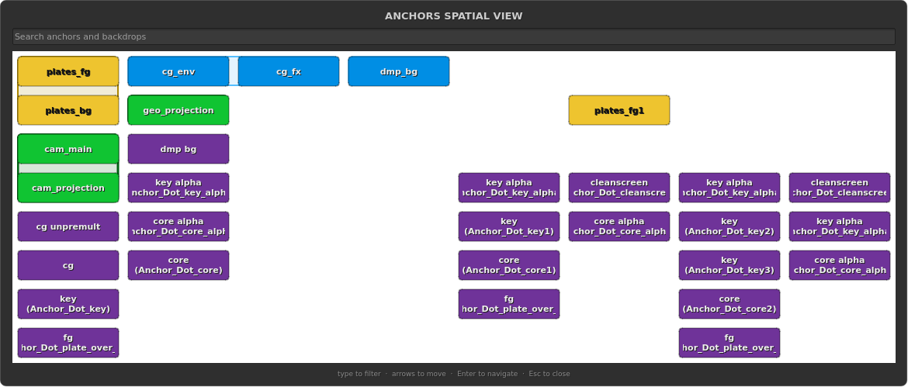{#fig:spatial-view}
The `spatial_view` scenario in docs/screenshots/scenarios/gui.json captures it. -->


## The leader key

Press **`Shift`+`A`** to raise the **leader overlay** — a translucent heads-up map
of every anchor command `(Figure \ref{fig:leader})`{=latex}. Press one key to run the action; the overlay then
disappears. Cells grey out when their preconditions are not met (for example, `W`
is disabled on a single-input node).

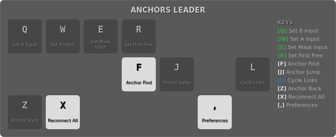{#fig:leader}

| Key | Action |
|-----|--------|
| `Q` | Set **B** input from an anchor (input 0) |
| `W` | Set **A** input from an anchor (input 1) |
| `E` | Set **Mask** input from an anchor |
| `R` | Set the **first free** input from an anchor |
| `S` | Spatial View (as `Alt`+`S`) |
| `F` | Anchor Find (as `Alt`+`A`) |
| `J` | Anchor Jump (as `Alt`+`J`) |
| `L` | Cycle Links (as `Alt`+`L`; keep pressing to chain) |
| `Z` | Anchor Back (as `Alt`+`Z`) |
| `X` | Reconnect All Links |
| `,` | Open Preferences |

The overlay grid matches your physical keyboard; **QWERTY**, **AZERTY**, and
**QWERTZ** layouts are supported (set in Preferences).


## Reconnecting links

Links are stateless — they resolve their anchor on demand — so you can rewire at
any time:

- **Reconnect All Links** (**Edit > Anchors > Reconnect All Links**, or leader
  `X`) rewires every link in the script. Handy after loading or merging scripts.
- **Reconnect Child Links** (button on each anchor) rewires just that anchor's
  links.
- **Reconnect** (button on each link) rewires that single link.

Because there are no callbacks or other shenanigans, nothing is stopping you from disconnecting a Link node, but you can always reconnect it if it does get disconnected.

## Colours

Anchors carry a tile colour `(Figure \ref{fig:input-block-colours})`{=latex} so related streams are easy to spot at a glance.

{#fig:input-block-colours}

Open the colour palette `(Figure \ref{fig:colour-palette})`{=latex} from an anchor's **Set Color** button. It offers Nuke's
preference colours, the colours already used by backdrops in the script, and your
own saved palette; **Custom Color...** opens a full picker.

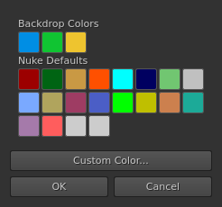{#fig:colour-palette}

Picking a colour applies it and closes the palette straight away. If you would
rather compare a few colours before committing, untick **Selecting a color closes
the color palette** in Preferences: the palette then only highlights each colour
you pick and stays open until you confirm with `Enter` or **OK** (or discard it
with `Esc`).

When you create an anchor, the dialog also offers a name field `(Figure \ref{fig:create-dialog})`{=latex} so you can name and
colour it in one step. New anchors pick a colour that contrasts with their
containing backdrop, so an anchor inside a coloured backdrop stays legible. Dot
anchors are always the default purple. Changing an anchor's colour updates all of
its links.

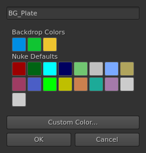{#fig:create-dialog}

## Automatic naming

When you create an anchor, the plugin suggests a name derived from the source —
typically from the read file path and the containing backdrop. The naming rule is
configurable in Preferences (an advanced **regex** and **template**, with a demo
filename to preview the result), so a studio can standardise anchor names. Special
characters are sanitised automatically; a name that sanitises to nothing is
rejected.

## Label utilities

Beyond Dot promotion, the label keys are general-purpose (they act on the selected
node):

| Key | Action |
|-----|--------|
| `Shift`+`M` | Label (Large) — 111 pt on Dots (promotes a plain Dot to an anchor), 33 pt on other nodes |
| `Shift`+`N` | Label (Medium) — 66 pt on Dots |
| `Shift`+`B` | Label (Small) — 33 pt on Dots |


## Setting up a backdrop

Backdrops carry the comp's structure, so `A` treats them as something to set up
rather than something to anchor. Select a single backdrop, press `A` (or use
**Edit > Anchors > Setup Backdrop**), and a dialog opens with everything a
backdrop needs in one place `(Figure \ref{fig:backdrop-setup})`{=latex}:

- a **label** field — multi-line, so a backdrop's notes survive a round trip;
- the same **colour palette** as the anchor dialogs, including your custom
  colours and hint-mode navigation;
- a **font size** dropdown offering the Dot-anchor sizes — Small (33), Medium
  (66), Large (111) — plus **Custom** for anything else. A backdrop already set
  to one of the three presets re-opens on that size; anything else, including
  Nuke's own default, opens on Large;
- a **Filled** checkbox — off draws the backdrop as an outline only.

Clicking a swatch confirms the whole dialog, as it does when renaming an anchor,
so a label and a colour are two keystrokes and a click. Pressing `Enter` inside
the multi-line label field adds a line; `Ctrl`+`Enter`, the **OK** button, or a
swatch click confirms. Selecting a backdrop *together with* its contents keeps
the old behaviour and creates an anchor from the selection.

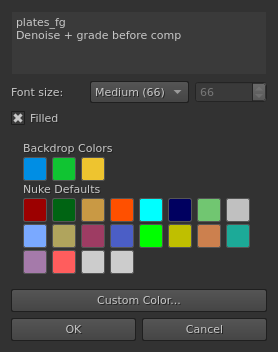{#fig:backdrop-setup}

## Upgrading a script built with another tool

Plenty of scripts already contain an anchor rig built by a different tool: a
labelled, coloured NoOp under a Read, with hidden-input nodes dotted around the
comp pointing back at it. It is the same idea as anchors, without the anchor
machinery — so the picker, navigation, reconnect and colour propagation all
ignore it.

**Edit > Anchors > Upgrade to Anchors...** adopts that rig. Each parent node
becomes a real anchor, and every hidden-input node pointing at it becomes a real
Link. Nodes are converted **in place**: a PostageStamp stays a PostageStamp, and
every node keeps its position and its downstream connections.

The dialog previews exactly what will change before anything is touched, and
offers:

- **Scope** — the selected nodes, or every anchor-like node in the script.
- **Parent nodes to upgrade** — NoOp and PostageStamp parents, Dot parents, or
  both. They are listed separately because the two usually want different naming.
- **Anchor names** — take the name from the node's label, its node name, or
  (the default) its label falling back to its node name. Set separately for NoOp
  and Dot parents, since a foreign NoOp usually carries a meaningful node name
  while a Dot is called something like `Dot17` and keeps its meaning in the label.
- **Strip leading / trailing text** — drop a tool's fixed affix, turning
  `Pointer_Foo` into `Foo`. A strip that would leave nothing behind is ignored.
- **Colours** — keep each node's existing tile colour, or take the colour the
  plugin would derive for a new anchor. Dot anchors always take the default
  anchor colour, as they do everywhere else.

Names are sanitised and made unique, so two parents that reduce to the same name
become `Anchor_Foo` and `Anchor_Foo1`. A node that is *both* a parent and someone
else's hidden-input child stays a parent — it becomes an anchor rather than a
Link. Nodes that are already anchors keep their name and colour; only their
children are upgraded. Running the upgrade a second time does nothing.

Like the other migrators, this is not undoable — save a backup of your script
first.

## Preferences and site configuration

**Edit > Anchors > Anchor Preferences...** controls:

- **Enable anchors plugin** — the master toggle.
- **Create a link below each new anchor** — on by default; uncheck it if you
  prefer creating links yourself.
- **Keyboard layout** — QWERTY / AZERTY / QWERTZ for the leader overlay.
- **Space-prefix search modes** — what leading spaces do in the fuzzy-find menus
  (see below).
- **Custom Colors** — add, edit, and remove the colours in your personal palette.
- **Selecting a color closes the color palette** — on by default; turn it off to
  keep the palette open until you confirm with `Enter` or **OK**.
- **Advanced** — the anchor **naming regex** and **template**, plus a **site
  config override**.

Settings are stored per user in `~/.nuke/anchors_prefs.json`. A studio can
**publish** the naming settings to a shared site-config file (pointed to by the
`ANCHORS_SITE_CONFIG` environment variable) so every artist gets consistent anchor
names; individuals can opt out with the site-config override.

### Space-prefix search modes

The `A` and `Alt`+`A` menus — and the spatial view's search field — filter as you
type, and typing one or two spaces before your search text switches how that text
is matched:

- **Anchored fuzzy** — the letters appear in order, starting at the first letter
  of the name: `bgp` finds `BG_Plate`.
- **Non-anchored fuzzy** — the letters appear in order anywhere in the name:
  `plt` finds `BG_Plate`.
- **Consecutive substring** — the text appears as typed: `plat` finds `BG_Plate`.

By default no leading space means anchored fuzzy, one space means non-anchored
fuzzy, and two spaces mean a consecutive substring search. The **Space-prefix
search modes** group in Preferences maps each of the three levels to whichever
mode you prefer; every mode must be used exactly once, so OK is refused if you
assign the same mode twice.

These search fields share their core with
[tabtabtab-nuke](https://github.com/charlesangus/tabtabtab-nuke), which offers the
same preference. If you run both, tick **Use tabtabtab-nuke preferences** and
anchors follows the mapping set there instead — the three dropdowns grey out and
show what tabtabtab is enforcing, and your own mapping is kept for when you untick
the box. The checkbox itself is greyed out when no tabtabtab-nuke installation is
found.


## Python API

For pipeline and templating tools, `api.py` is the stable, documented surface.
Both functions require a running Nuke session.

```python
from api import create_anchor, find_anchor_by_name

# Create an anchor wired to a source node, with an explicit colour.
source = nuke.toNode('Read_BG')
anchor_node = create_anchor('BG_Plate', input_node=source, color=0x8040FFFF)

# Look one up before creating a duplicate.
existing = find_anchor_by_name('BG_Plate')
if existing is None:
    existing = create_anchor('BG_Plate')
```

- `create_anchor(name, input_node=None, color=None)` -> the new anchor node.
  Raises `ValueError` if *name* sanitises to empty.
- `find_anchor_by_name(display_name)` -> the matching anchor node, or `None`.


## Keyboard reference

| Shortcut | Action |
|----------|--------|
| `A` | Create anchor (selection) / Set up backdrop (one backdrop selected) / Anchor selection menu (no selection) |
| `Shift`+`A` | Leader-key overlay |
| `Alt`+`A` | Anchor Find / navigate |
| `Alt`+`S` | Spatial view — map of the script's anchors and backdrops |
| `Alt`+`J` | Anchor Jump (Link -> anchor) |
| `Alt`+`L` | Cycle Links |
| `Alt`+`Z` | Anchor Back |
| `Alt`+`H` | Toggle input visibility (make a Local Dot) |
| `Ctrl`+`C` / `Ctrl`+`X` / `Ctrl`+`V` | Copy / Cut / Paste with reconnection |
| `Ctrl`+`Shift`+`D` | Paste (old) — plain paste, no reconnection |
| `Shift`+`M` / `Shift`+`N` / `Shift`+`B` | Label Large / Medium / Small |
| `Ctrl`+`M` | Append to label |

All anchor shortcuts are scoped to the Node Graph, so they never intercept keys in
the Viewer or Script Editor.

